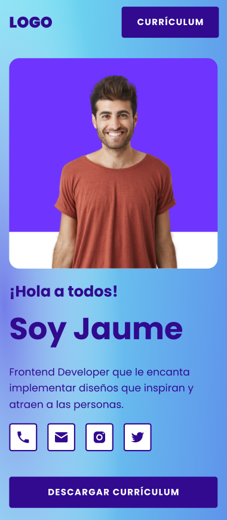

# HTML CSS Briefcase &middot; 

Portafolio personal realizado con HTML y CSS junto con buenas prácticas

> HTML5

> CSS3

> Flexbox

> Responsive design

> Mobile First

Descripción del proyecto : Portafolio de figma a web, solamente HTML5 + CSS

# Levantar proyecto

* Solo es necesario abrir el fichero index.html en un navegador

## Equipo

Desarrollado por Diego Cortés

* dcortes.net@gmail.com

